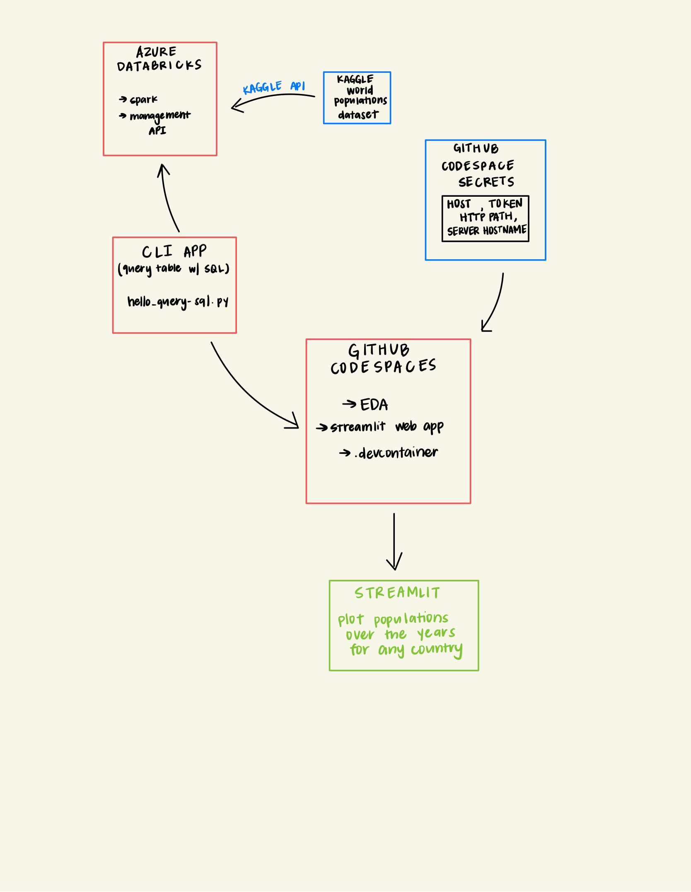

# Project 1: Retrieving World Population Data to Visualize Population Growth over the last 30 years

## Architectural Diagram

## Key Objectives
* The purpose of this project is to retrieve and house world population data with the help of Databricks. The data table can be retrieved with a CLI tool. There is also a Streamlit app that can be used to visualize the population trend for any country from 1970 - 2022. 

## Repository Breakdown
Scaffolding: 
* .devcontainer: running Docker container 
* requirements.txt: packages utilized for this project
* Makefile: loads required packages, formatting, testing and linting

Data: 
* datasets: contains world_population.csv
* eda.ipynb: basic EDA to check for missing values and simple visualizations

Databricks: 
* dblib: functions that link to databricks, load in dataset for web app retrieval
* hello_query_sql.py: CLI to retrieve first few rows of data

Streamlit web app: 
* st_run.py: run following program to open web app to plot population trends for any country
    - terminal command found in docstring

## Demo Video Link
